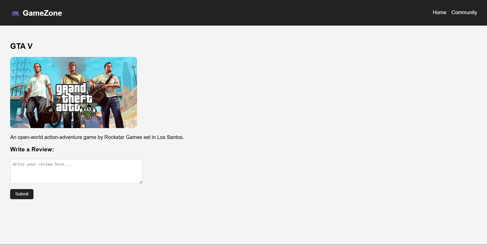

# 🎮 GameZone — Gaming Responsive Website

  
*A multi-page, responsive gaming-themed website built using HTML and CSS.*

---

## 🌐 Live Demo
🚀 Check out the deployed project here:  
👉 [GameZone Live on Vercel](https://gaming-responsive-website.vercel.app/)

---

## ✨ Features

- 📱 **Responsive Layout** — adapts across desktop, tablet, and mobile screens  
- 🎨 **Gaming-Inspired UI** — dark navigation bar and card-based layout  
- 🖼️ **Trending Games Section** — static showcase of popular games like Valorant, GTA V, and Minecraft  
- 🔗 **Multi-Page Navigation** — Home, Community, Contact, Login, Signup, and individual game pages  
- 📝 **Form UI Design** — styled forms for login, signup, contact, and reviews (UI only)

---

## 🛠️ Tech Stack

- **HTML5** — semantic structure and multi-page layout  
- **CSS3** — Flexbox layouts, card UI, and responsive styling  
- **Vercel** — static site deployment  

> ⚠️ Note: This is a frontend-only project. Forms and review sections are UI-based and do not include backend functionality or data persistence.

---

## 📸 Screenshots

### Review Page


---

## 🚀 Getting Started

Follow these steps to run the project locally:

### 1. Clone the repository
```bash
git clone https://github.com/UjjwalKharkwal/Gaming-Responsive-Website.git
2. Open the project
bash
Copy code
cd Gaming-Responsive-Website
3. Run the project
Open index.html directly in your browser, or

Use Live Server in VS Code for a better development experience

🎯 Project Purpose
This project was built to strengthen frontend fundamentals, including:

Page structuring and navigation

Responsive layout design

CSS styling and UI consistency

Multi-page website organization

It served as a foundational project before moving on to full-stack MERN applications.

🤝 Contributing
Contributions, issues, and suggestions are welcome!

Fork the repository

Create a feature branch: git checkout -b feature/your-feature

Commit your changes: git commit -m "Add feature"

Push the branch: git push origin feature/your-feature

Open a Pull Request

📄 License
This project is licensed under the MIT License — see the LICENSE file for details.

👨‍💻 Author
Ujjwal Kharkwal

GitHub: @UjjwalKharkwal

Live Demo: GameZone on Vercel

⭐ If you like this project, consider giving it a star on GitHub!
