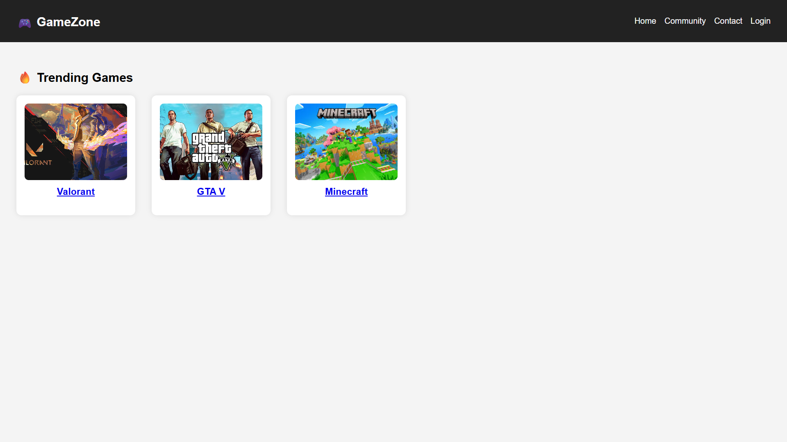

# 🎮 GameZone — Gaming Responsive Website

  
*A fully responsive gaming website with modern UI/UX design, built using HTML, CSS, and JavaScript.*

---

## 🌐 Live Demo
🚀 Check out the deployed project here:  
👉 [GameZone Live on Vercel](https://gaming-responsive-website.vercel.app/)

---

## ✨ Features

- 📱 **Fully Responsive** — adapts seamlessly across mobile, tablet, and desktop  
- 🎨 **Gaming-Inspired UI** — dark theme, bold typography, and immersive design  
- 🖼️ **Trending Games Section** — showcases popular titles like Valorant, GTA V, and Minecraft  
- 🔗 **Navigation Bar** — includes Home, Community, Contact, and Login pages  
- ⚡ **Lightweight & Fast** — optimized for performance  

---

## 🛠️ Tech Stack

- **HTML5** — semantic markup  
- **CSS3** — responsive layouts & animations  
- **JavaScript (Vanilla)** — interactivity and enhancements  
- **Vercel** — deployment & hosting  

---

## 📸 Screenshots

### Homepage


### Mobile View


---

## 🚀 Getting Started

Follow these instructions to set up the project locally:

### 1. Clone the repository
```bash
git clone https://github.com/UjjwalKharkwal/Gaming-Responsive-Website.git
````

### 2. Open the project

```bash
cd Gaming-Responsive-Website
```

### 3. Run the project

* Open `index.html` directly in a browser, or
* In VS Code, install the **Live Server extension** → right-click `index.html` → *Open with Live Server*

---

## 🤝 Contributing

Contributions, issues, and feature requests are welcome!

1. Fork the repository
2. Create a new branch: `git checkout -b feature/your-feature`
3. Commit your changes: `git commit -m 'Add some feature'`
4. Push to the branch: `git push origin feature/your-feature`
5. Open a Pull Request

---

## 📄 License

This project is licensed under the **MIT License** — see the [LICENSE](LICENSE) file for details.

---

## 👨‍💻 Author

**Ujjwal Kharkwal**

* GitHub: [@UjjwalKharkwal](https://github.com/UjjwalKharkwal)
* Live Demo: [GameZone on Vercel](https://gaming-responsive-website.vercel.app/)

---

⭐ If you like this project, don’t forget to **star the repo** on GitHub!

```


---

👉 Do you want me to also add **shields.io badges** (like GitHub stars, forks, last commit, deployment status) at the top for a **GitHub Pro look**?
```
